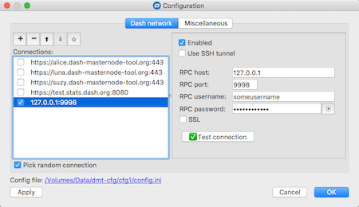
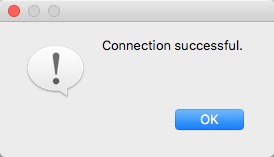

# Connection to a local Hilux daemon
In this scenario, you will use your own Hilux daemon configured to serve JSON-RPC requests on your local network or any network you can access directly. The most convenient way to achieve this is to run a daemon on the same computer as the DMT application itself.

## Install the Hilux Core wallet
We will use the official Hilux Core client as the Hilux daemon for this configuration. Install it now if not already installed. Binary installers for macOS, Linux and Windows can be downloaded from the [official site](https://www.hilux.org/wallets), while documentation on the installation process is available on the [Hilux Wiki](https://docs.hilux.org/en/stable/wallets/hiluxcore/installation.html).

## Enable JSON-RPC and "indexing" in Hilux Core
###  Set the required parameters in the `hilux.conf` file
The default Hilux Core configuration does not include all the required settings, so some changes to the `hilux.conf` file are necessary. The location of this file varies depending on the operating system you are using and may be changed during installation, so paths will not be specified here due to possible confusion. Instead, select `Tools -> Open Wallet Configuration File` from the Hilux Core menu. The `hilux.conf` file will open in your default text editor.

Copy and paste the following parameters/values into the file, changing the `rpcuser` and `rpcpassword` values to your own unique values:
```ini
rpcuser=any_alphanumeric_string_as_a_username
rpcpassword=any_alphanumeric_string_as_a_password
rpcport=9998
rpcallowip=127.0.0.1
server=1
addressindex=1
spentindex=1
timestampindex=1
txindex=1
```

### Restart Hilux Core

Close Hilux Core by selecting `File -> Exit` from the menu, then open it again.

### Rebuild index
Setting parameters related to indexing and even restarting the application is not enough for Hilux Core to entirely update its internal database to support indexing, so it is necessary to force the operation. These are steps to take:

 * Select the `Tools -> Wallet Repair` menu item.
 * Click the `Rebuild index` button in the Wallet Repair dialog box.  
    
 * Wait until the operation is complete. This step may take several hours.

## Configure connection in the DMT
 * Open DMT and click the `Configure` button.
 * Select the `Hilux network` tab.
 * Click the `+` (plus) button on the left side of the dialog.
 * Check the `Enabled` box.
 * Enter the following values:
   * `RPC host`: 127.0.0.1
   * `port`: 9998
   * `RPC username`: enter the value you specified for the `rpcuser` parameter in the `hilux.conf` file.
   * `RPC password`: enter the value you specified for the `rpcpassword` parameter in the `hilux.conf` file.
 * Make sure the `Use SSH tunnel` and `SSL` checkboxes remain unchecked. Also, if you decide to use only this connection, deactivate all other connections by unchecking the corresponding `Enabled` checkboxes.  
    
 * Click the `Test connection` button. If successful, DMT will return the following message:  
    
